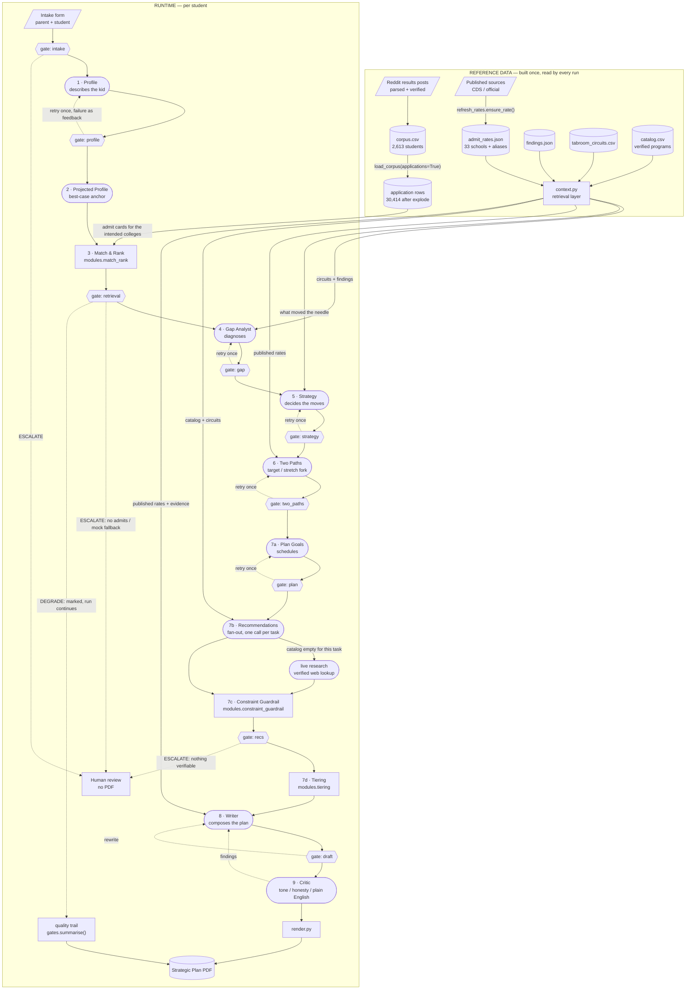

# Compass — agent orchestration

How the pieces actually run. Every box below exists in the code: agent steps
resolve through `compass/prompts.py::BY_STEP`, deterministic steps through
`compass/modules.py`, gates through `compass/gates.py`, and the order is
`compass/pipeline.py::run()`.

**Shape grammar:** stadium = LLM agent · rectangle = deterministic module ·
cylinder = stored data · hexagon = runtime gate · parallelogram = input ·
dashed edge = failure path (retry, rewrite, escalate).

---

## The boundary the shape enforces

**Profile describes → Gap diagnoses → Strategy decides → Two Paths forks →
Plan schedules → Recommendations sources → Writer writes → Critic checks.**

No step does the job of the step before it. A profile that diagnoses, or a
writer that decides, is a bug — not a style problem. `gate_profile` fails a
profile containing numbers for exactly this reason.

## Steps

| # | Step | Kind | Reads | Gate |
|---|---|---|---|---|
| 1 | Profile | agent (top) | intake | `gate_profile` — retry |
| 2 | Projected Profile | agent (mid) | profile | — |
| 3 | Match & Rank | module | 30,414 application rows | `gate_retrieval` — escalate / degrade |
| 4 | Gap Analyst | agent (top) | profile, cards, tally, circuits + findings | `gate_gap` — retry |
| 5 | Strategy | agent (top) | gap map, profile, findings | `gate_strategy` — retry |
| 6 | Two Paths | agent (top) | selected moves, admit pattern, published rates | `gate_two_paths` — retry |
| 7a | Plan Goals | agent (mid) | selected moves, profile, grade | `gate_plan` — retry |
| 7b | Recommendations | agent (mid), fan-out per task | catalog, circuits, constraints | — |
| 7c | Constraint Guardrail | module | recommendations, constraints | `gate_recs` — escalate |
| 7d | Tiering | module | intended colleges, seed | — |
| 8 | Writer | agent (mid) | the whole plan, published rates, evidence | `gate_draft` |
| 9 | Critic | agent (top) | draft | — |
| — | Comparisons | agent (top) | profile, cards | supplement, run separately |

## Gate verdicts

A gate does not ask "is this good?" It asks **"is this good enough for the next
step to mean anything?"** Four verdicts:

- **PASS** — continue.
- **DEGRADE** — continue, but mark the run. A degraded run is always visible in
  the output; it never passes silently.
- **RETRY** — re-run the step once, handing it the failure as feedback.
- **ESCALATE** — stop. No PDF. A human decides. Used only where continuing would
  produce something a family might act on and be harmed by.

`gate_retrieval` is the one that matters most. Empty or fabricated retrieval
makes every downstream step fiction *and looks completely normal in the PDF* —
which is exactly how it caught `match_rank` returning 0 cards from a 30,414-row
table on its first live run.

## Two rules the drawing encodes

**Numbers belong to modules.** Counts, bands, tiers and rates are computed by
deterministic code and handed to agents. An agent that states a number it was
not handed is a bug, not a phrasing issue.

**The corpus and the rate table answer different questions.** The corpus answers
*"what does an admit to this school look like?"* The published rate table
answers *"how selective is this school?"* The corpus never produces an admit
rate — it is self-selected, and 32.6% of posts omit rejections.

---

Source: [`orchestration.mmd`](orchestration.mmd) · Rendered image for slides:
[`orchestration.png`](orchestration.png) · Standalone page:
[`orchestration_page.html`](orchestration_page.html) · Rules and their history:
[`ENGINE_FEEDBACK_LOG.md`](../ENGINE_FEEDBACK_LOG.md) · Gate detail:
[`evals/GATES.md`](../evals/GATES.md)
